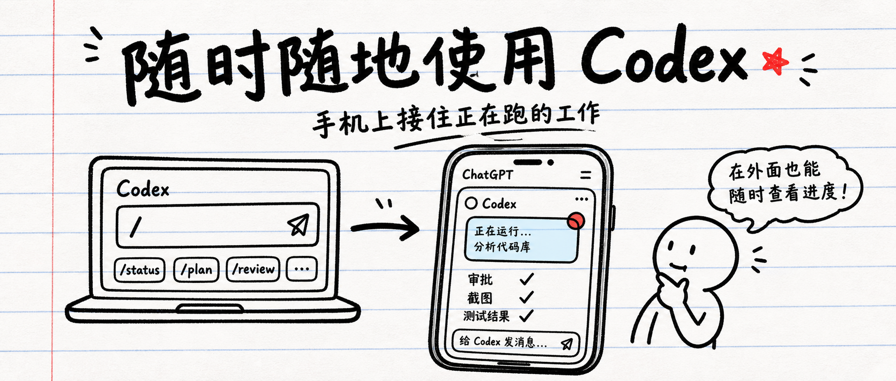
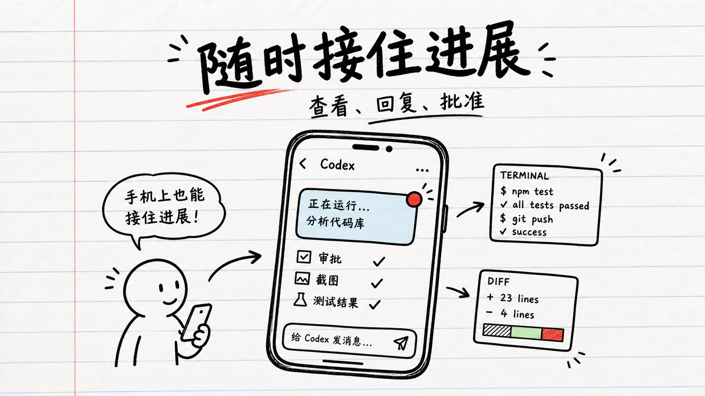
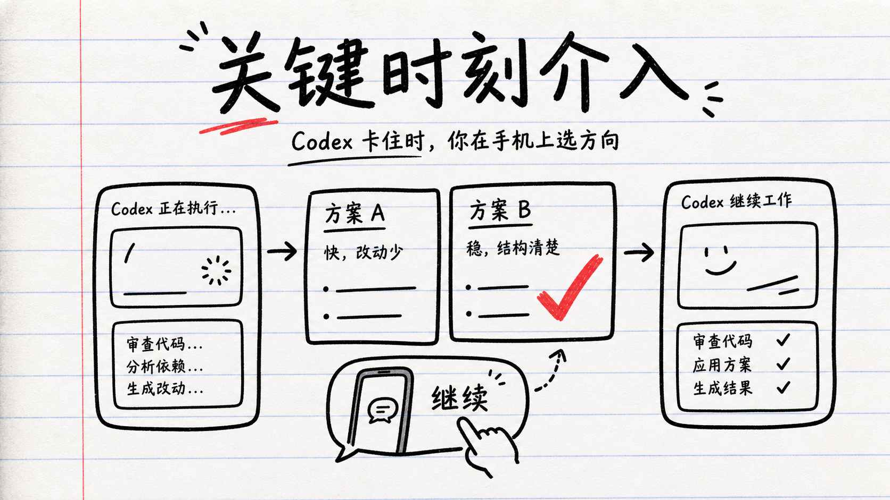
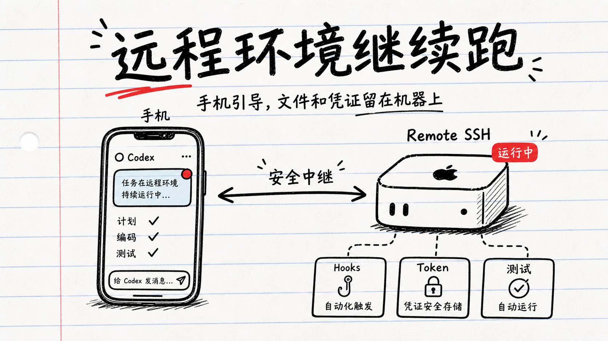

<div align="center">

# inknote-article-visuals

**Notebook-style doodle visuals for articles**

面向文章与内容平台的手帐涂鸦风配图技能

Works with Claude Code and OpenAI/Codex-style agents.


[中文](#中文) | [English](#english) | [Style Guide](references/style-guide.md)

</div>

---

<a id="中文"></a>

## 中文

面向文章与内容平台的手帐涂鸦风配图技能。

`inknote-article-visuals` 可以把中文文章选题、文章草稿或完整文章，转成一组可直接使用的封面图和内文插图。它特别适合 AI 产品、Vibe Coding、设计工具、创作者工具、效率工具和个人知识工作类内容。



## 示例：OpenAI Codex 移动端文章

下面这组图来自一篇关于 Codex 登陆 ChatGPT 移动应用的文章示例。目标不是做复杂信息图，而是让读者在手机上快速抓住每一节的意思。

| 封面图 | 内文图 |
| --- | --- |
|  |  |
| 随时随地使用 Codex | 随时接住进展 |
|  |  |
| 关键时刻介入 | 远程环境继续跑 |

## 一句话用法

```text
用 $inknote-article-visuals 给这篇文章出一套配图：1 张封面 + 3 张内文图。
```

默认会先生成 1 张封面图确认风格；你确认后，再继续生成内文图。如果想一次性生成整套，可以直接说明“全部一次出图”。

封面默认是一张组合母图：左侧为 `2.35:1` 横版信息流封面，右侧为重新构图的 `1:1` 方形分享封面。两部分等高拼接，最终只交付一张约 `3.35:1` 的图片，方便在需要双尺寸封面的平台中分别框选。

## 双尺寸封面母图

```text
┌────────────── 2.35:1 横版封面 ──────────────┬──────── 1:1 方形封面 ────────┐
│              完整标题与横向构图              │       精简标题与重组构图       │
└─────────────────────────────────────────────┴──────────────────────────────┘
```

部分内容平台会从同一张上传图片中分别框选横版封面和方形分享封面。为了让两个场景都能获得合适的构图，这个技能不会直接把横版居中裁成方形，而是：

1. 左侧设计一张 `2.35:1` 横版封面，保留完整标题和横向构图。
2. 右侧重新设计一张 `1:1` 方形封面；标题过长时可以精简，并重新安排主体和留白。
3. 将两部分等高拼接成一张 `3.35:1` 母图。上传到目标平台后，分别框选左侧横版和右侧方形区域。

## 适合做什么

- 生成文章封面图
- 生成文章内小插图
- 为长文章设计一组统一风格配图
- 把一篇文章拆成 3-6 个视觉节点
- 默认优先直接生成成品图
- 图片生成工具不可用时，退回输出 Prompt

## 视觉风格

- 白色笔记本纸
- 浅蓝色横线
- 一条红色页边线
- 黑色马克笔手绘线条
- 不完美的方框、箭头、UI 卡片、便签、文件夹、鼠标指针和小人
- 少量红、黄、蓝或绿色点缀
- 适合手机阅读，不做复杂信息图

## 更多使用示例

```text
用 $inknote-article-visuals 给这篇文章直接出一张封面图。
```

```text
Use $inknote-article-visuals to generate a cover image for this article.
```

## Claude Code 使用

Claude Code 主要读取 `SKILL.md`。`agents/openai.yaml` 不是 Claude Code 必需文件。

推荐安装方式：

```text
~/.claude/skills/inknote-article-visuals/
├── SKILL.md
├── assets/
└── references/
```

本地安装命令：

```bash
mkdir -p ~/.claude/skills/inknote-article-visuals
cp -R SKILL.md assets references ~/.claude/skills/inknote-article-visuals/
```

安装后可以在 Claude Code 中使用：

```text
/inknote-article-visuals 给这篇文章生成配图。
```

如果当前 Claude Code 环境没有图片生成工具，这个技能会退回输出完整 Prompt。

## 推荐输出

普通文章：

- 先出 1 张封面图确认风格
- 3 张内文插图
- 每张图附一条简短使用建议

早期选题阶段：

- 输出视觉分镜
- 需要时再输出 Prompt

## 目录结构

```text
inknote-article-visuals/
├── .gitignore
├── SKILL.md
├── README.md
├── agents/
│   ├── README.md
│   └── openai.yaml
├── assets/
│   ├── style-reference.jpg
│   └── examples/
│       ├── codex-mobile-cover.png
│       ├── codex-mobile-work-anywhere.png
│       ├── codex-mobile-decision.png
│       └── codex-mobile-remote-ssh.png
├── references/
│   └── style-guide.md
└── output/
    └── .gitkeep
```

## 说明

这个技能不是单纯写 Prompt，而是服务于文章生产流程：目标是直接拿到一组风格统一、能放进文章里的配图。

`assets/examples/` 中的示例图是当前风格基准：后续生成应尽量对齐它们的纸张质感、粗黑手写标题、手绘 UI 卡片和少量红色点缀。

`agents/openai.yaml` 是给 OpenAI/Codex 类界面使用的可选元数据，用来提供展示名、简介和默认提示词。Claude Code 使用时主要依赖 `SKILL.md`。

如果用户没有指定保存位置，最终成品会固定保存到这个技能目录的 `output/`。文章来自桌面、Obsidian 或其他项目都不会改变输出位置。用户指定路径时，以用户路径为准。生成过程中的草稿不会复制进去，同名文件会自动使用 `-v2`、`-v3` 等后缀，避免覆盖已有图片。

## English

Notebook-style doodle illustrations for articles and content platforms.

`inknote-article-visuals` turns Chinese article ideas, drafts, or finished articles into usable cover images and in-article illustrations. It is tuned for AI product, Vibe Coding, design tools, creator workflows, productivity, and personal knowledge-work topics.


## Example: OpenAI Codex Mobile Article

This sample visual set is based on an article about Codex becoming available in the ChatGPT mobile app.

| Cover | In-article visuals |
| --- | --- |
|  |  |
| Use Codex Anywhere | Catch progress on mobile |
|  |  |
| Step in at key moments | Remote environments keep running |

## What It Does

- Creates article cover images
- Creates section illustrations for long articles
- Designs a consistent visual set for one article
- Splits an article into 3-6 visual beats
- Generates finished images by default
- Falls back to prompt-only output when direct image generation is unavailable

## Visual Style

- White notebook paper
- Pale blue ruled lines
- One red margin line
- Black marker doodles
- Imperfect boxes, arrows, UI cards, sticky notes, folders, cursors, and small people
- One or two small color accents
- Mobile-readable composition for online articles

## Example Prompts

```text
Use $inknote-article-visuals to generate a cover image for this article.
```

```text
Use $inknote-article-visuals to create a full visual package: 1 cover image + 3 in-article illustrations.
```

By default, the skill generates the cover first for style confirmation, then continues with the in-article visuals after approval. Ask for all images in one pass if you want the full set immediately.

The default cover deliverable is one combined master image: an equal-height `2.35:1` landscape cover on the left and a separately composed `1:1` square cover on the right. They are joined into one `3.35:1` image so each region can be selected on platforms that require both formats.

## Combined Dual-Format Cover Master

```text
┌────────── 2.35:1 landscape cover ──────────┬────── 1:1 square cover ──────┐
│      Full headline + horizontal layout      │   Short title + recomposed   │
└─────────────────────────────────────────────┴─────────────────────────────┘
```

Some content platforms select a landscape feed cover and a square share-card cover from the same uploaded source image. To give each placement a suitable composition, the skill does not simply center-crop the landscape cover into a square:

1. The left `2.35:1` panel uses the full concise headline and a horizontal composition.
2. The right `1:1` panel is recomposed for the square format. Long copy may be shortened, with the focal sketch and whitespace rebalanced.
3. Both panels are joined at the same height into one `3.35:1` master image. In the target platform's cover editor, select the landscape region on the left and the square region on the right.

## Claude Code Usage

Claude Code uses `SKILL.md` directly. `agents/openai.yaml` is not required for Claude Code.

Recommended install location:

```text
~/.claude/skills/inknote-article-visuals/
├── SKILL.md
├── assets/
└── references/
```

Install locally:

```bash
mkdir -p ~/.claude/skills/inknote-article-visuals
cp -R SKILL.md assets references ~/.claude/skills/inknote-article-visuals/
```

After installation, use:

```text
/inknote-article-visuals generate visuals for this article.
```

If no image generation tool is available in the current Claude Code environment, the skill falls back to complete image prompts.

## Recommended Output

For a typical article:

- 1 cover image first for style confirmation
- 3 in-article illustrations
- Short usage note for each image

For early ideation:

- Visual shot list
- Prompt-only output when requested

## Notes

This skill is designed for article production workflows where the goal is not only to write prompts, but to produce usable visuals with a consistent editorial illustration style.

The images in `assets/examples/` are the current style baseline for paper texture, rough hand-lettered titles, hand-drawn UI cards, and restrained red accents.

`agents/openai.yaml` is optional metadata for OpenAI/Codex-style interfaces. It provides display text and a default prompt, but Claude Code primarily relies on `SKILL.md`.

If the user does not provide a save location, final selected images are always stored in `output/` inside this skill's directory. The article path, current working directory, and host project do not change that location. A user-provided path takes priority. Drafts are not copied there, and existing files are preserved by adding suffixes such as `-v2` or `-v3`.
